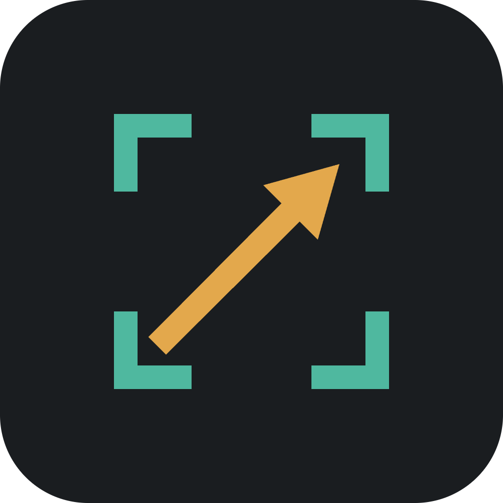

# DocShot

<p align="center">
  
</p>

<p align="center">
  A fast, local-first macOS utility for screenshots, recordings, and lightweight annotation.
</p>

<p align="center">
  <strong>Swift 6</strong> · <strong>SwiftUI</strong> · <strong>AppKit</strong> · <strong>ScreenCaptureKit</strong>
</p>

## What it does

DocShot lives in the menu bar and keeps the capture flow intentionally explicit: select exactly
what to capture, make any edits locally, then choose whether to copy, save, export, or discard.
It has no account, cloud upload, history library, analytics, or background sync.

### Screenshots

- Global capture shortcut: `⌘⇧6` by default, configurable in Settings.
- Detect an application window on hover or drag an exact region across displays.
- Add arrows, shapes, text, highlights, blur/pixelate redactions, crop, undo, and redo.
- Copy PNG, Save with a native panel, or Discard without touching disk or clipboard.
- Export at native, 50%, 200%, or a custom aspect-locked size.

### Screen recordings

- Start recording with `⌘⇧8` or the menu-bar action.
- Select a window or a single-display region, then explicitly confirm before the stream starts.
- Save H.264 MP4 locally, or discard the temporary take.
- System audio is opt-in and off by default; cursor capture has its own recording preference.
- Export a silent GIF for clips up to 15 seconds, at 10 fps and a 960 px maximum long edge. GIFs
  over 10 MB fall back to the MP4 flow.
- Edit a completed recording before export: trim, split, annotate, redact, and render a separate
  output while preserving the original MP4.

## Privacy by design

Everything happens on the Mac. Screen capture permission is used only for the selected capture
or recording. Output exists only after an explicit Copy or Save action; temporary recordings are
removed on cancel, discard, failure, quit, and next launch cleanup.

## Demo media

Live screenshots and a short recording walkthrough are intentionally captured from the signed
development build rather than fabricated. The repeatable capture script is in
[docs/README_MEDIA_CAPTURE.md](docs/README_MEDIA_CAPTURE.md); place approved assets in
`docs/media/` and link them here before making the PR ready for review.

## Run locally

### Requirements

- macOS 14 or later
- Xcode 16 or later / Swift 6

Open `DocShot.xcodeproj`, choose the **DocShot** scheme, run on **My Mac**, and grant Screen
Recording permission when macOS asks. The app is Apple Development-signed for local development;
it is not notarised or distributed as a public installer.

## Verify

```bash
swift test
xcodebuild test -project DocShot.xcodeproj -scheme DocShot -destination 'platform=macOS'
./Scripts/audit-test-parity.sh
```

The current suite covers the pure capture, recording, output, editor, cleanup, and timing logic
through both SwiftPM and Xcode test paths. Device-level checks are tracked in
[docs/DEVICE_VERIFICATION.md](docs/DEVICE_VERIFICATION.md).

## Architecture

- [Recording architecture](docs/RECORDING_ARCHITECTURE.md)
- [Video editor architecture](docs/VIDEO_EDITOR_ARCHITECTURE.md)
- [Test architecture](docs/TEST_ARCHITECTURE.md)
- [Product brief](docs/PRODUCT_BRIEF.md)

## Status

DocShot is an actively developed native macOS project. The screenshot workflow, MP4 recording,
opt-in system audio, bounded GIF export, and post-stop editor are implemented. Packaging,
notarisation, and public distribution are deliberately out of scope for this repository today.
